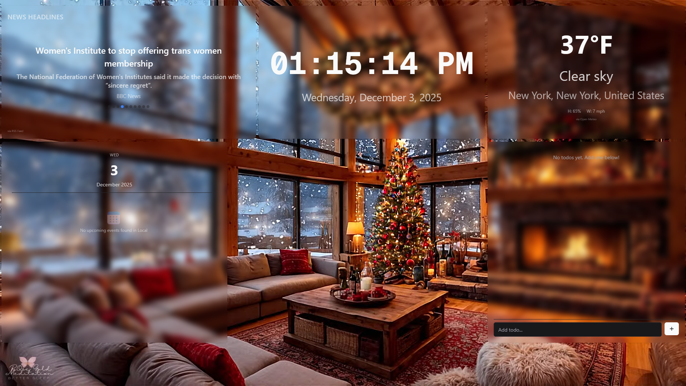
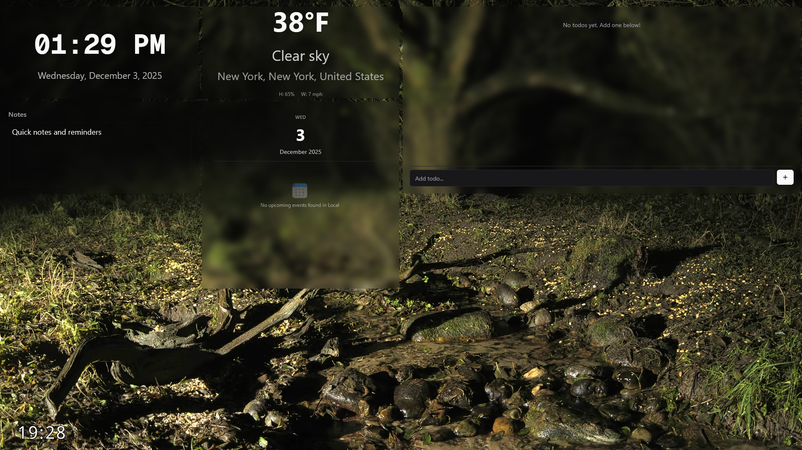
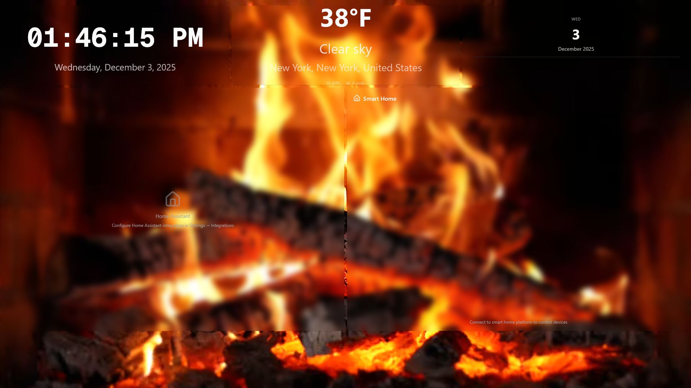

<div align="center">
  <table>
    <tr>
      <td align="center"></td>
      <td align="center"></td>
    </tr>
    <tr>
      <td align="center"></td>
      <td align="center"></td>
    </tr>
  </table>
</div>

# Zero Board

A Self-hosted digital board for displaying events, weather, news and other widgets. Works on small to large screens, portrait or landscape. Clean, customizable, secure, and responsive.

## Quick Start

### Prerequisites

- Docker and Docker Compose (recommended)
- OR Node.js 20+ and Python 3.11+ (for local development)

### Using Docker Compose (Recommended)

1. Clone the repository:
   ```bash
   git clone <repository-url>
   cd ZeroBoard
   ```

2. **Configure Environment Variables**:
   ```bash
   cp .env.sample .env
   # Edit .env with your configuration values
   ```

3. Start all services:
   ```bash
   docker-compose up -d
   ```

   This will start:
   - Backend API on http://localhost:8000 (or port from .env)
   - Frontend on http://localhost:3000 (or port from .env)
   - SQLite database (default) or PostgreSQL/MySQL if configured

4. **Get Admin Credentials**:
   After the backend starts, check the Docker logs:
   ```bash
   docker logs zero-board-backend
   ```
   
   Or check the log file:
   ```bash
   cat logs/zero-board.log
   ```
   
   You'll see output like:
   ```
   ================================================================================
   ZERO BOARD - ADMIN CREDENTIALS
   ================================================================================
   Username: zbadmin
   Password: <generated-password>
   ================================================================================
   ```


### Local Development

## Project Structure

```
ZeroBoard/
├── backend/          # FastAPI backend application
├── zero-board/       # Next.js frontend application
├── logs/             # Application logs
└── docker-compose.yml
```

#### Backend

1. Navigate to backend directory:
   ```bash
   cd backend
   ```

2. Create virtual environment:
   ```bash
   python -m venv venv
   source venv/bin/activate
   ```

3. Install dependencies:
   ```bash
   pip install -r requirements-dev.txt
   ```

4. Create `.env` file (copy from `env.example`):
   ```bash
   cp env.example .env
   # Edit .env with your settings
   ```

5. Update `.env` with your database configuration (SQLite by default):
   ```env
   DATABASE_TYPE=sqlite
   DATABASE_URL=sqlite+aiosqlite:///./zeroboard.db
   ```

6. Start server:
   ```bash
   uvicorn app.main:app --reload --host 0.0.0.0 --port 8000
   ```

   The server will automatically:
   - Initialize database schema (create tables if they don't exist)
   - Create admin user if no users exist
   - Print admin credentials to console and `logs/zero-board.log`

#### Frontend

1. Navigate to frontend directory:
   ```bash
   cd zero-board
   ```

2. Install dependencies:
   ```bash
   npm install
   ```

3. Create `.env.local` file:
   ```env
   NEXT_PUBLIC_API_URL=http://localhost:8000
   ```

4. Start development server:
   ```bash
   npm run dev
   ```

   Frontend will be available at http://localhost:3000

## Environment Variables

### Root Level (.env)

For Docker Compose, create a `.env` file in the root directory:
```bash
cp .env.sample .env
```

See `.env.sample` for all available options. Key variables:

- `DATABASE_TYPE`: `sqlite`, `postgresql`, or `mysql`
- `DATABASE_URL`: Database connection string
- `SECRET_KEY`: **REQUIRED in production** - Secret key for sessions (generate with `python3 -c "import secrets; print(secrets.token_urlsafe(32))"`)
- `CORS_ORIGINS`: Comma-separated list of allowed origins (e.g., `https://yourdomain.com`)
- `NEXT_PUBLIC_API_URL`: Backend API URL for frontend
- `BACKEND_PORT`: Backend port (default: 8000)
- `FRONTEND_PORT`: Frontend port (default: 3000)

### Backend (.env)

For local development without Docker, see `backend/env.example` for backend-specific options.

### Frontend (.env.local)

For local frontend development, create `.env.local`:
- `NEXT_PUBLIC_API_URL`: Backend API URL (e.g., `http://localhost:8000`)

## Admin Password Management

### Getting Admin Password

On first run, the admin password is automatically generated and logged to:
- Console output (stdout)
- `logs/setup.log` file

### Resetting Admin Password

Use the provided script:
```bash
cd backend
python scripts/reset_admin_password.py
```

The new password will be printed to console and logged to `logs/setup.log`.


## Contributing

We welcome contributions! Please see [CONTRIBUTING.md](CONTRIBUTING.md) for guidelines on how to submit issues and pull requests.

## Security

For security concerns, please see [SECURITY.md](SECURITY.md) for reporting vulnerabilities.

## License

This project is licensed under the MIT License - see the [LICENSE](LICENSE) file for details.

<p align="center">
  <a href="https://github.com/loqteklabs/Zer0Board">
   
  </a>
</p>
